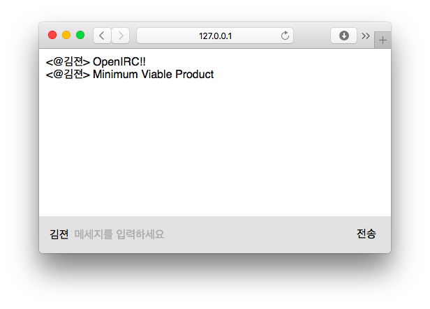

OpenIRC
========
> :heartbeat: IRC Client for everyone!

Making open source alternative of [IRCCloud] is this project's very first goal.
Join our IRC channel if you're interested!

- **#openirc** of [Ozinger IRC network]
- **#openirc-test** of [Ozinger IRC network]

If you are interested in contributing to the OpenIRC project, take a look at our
development documentation!

- **[Project structure](doc/project-structure.md)**
- [Setting up your own RabbitMQ cluster](doc/setting-up-rabbitmq-cluster.md)

--------

[GNU AGPL 3.0 License](LICENSE.md)

[Ozinger IRC network]: http://ozinger.org/
[IRCCloud]: https://www.irccloud.com/
