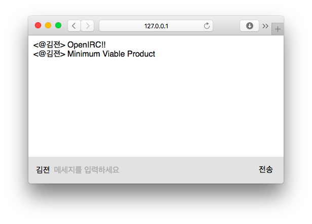

OpenIRC
========
> :heartbeat: IRC Client for everyone!



Making open source alternative of [IRCCloud] is this project's very first goal.
Join our IRC channel if you're interested!

- **#openirc** of [Ozinger IRC network]
- **#openirc-test** of [Ozinger IRC network]

### Directory structure
[Client side codes](client/)
```bash
▾ client/
  ▸ src/                # Client-side assets (js, css, ...)
    package.json        # Client-side libraries
    webpack.config.js
    ...
```

[Server side codes](server/)
```bash
▾ server/
  ▾ public/             # Files that will be statically served
    ▸ build/            # Build results of client-side assets
      ...
      index.html
  ▸ src/                # Server-side codes
    ...
```

--------

[GNU AGPL 3.0 License](LICENSE.md)

[Ozinger IRC network]: http://ozinger.org/
[IRCCloud]: https://www.irccloud.com/
